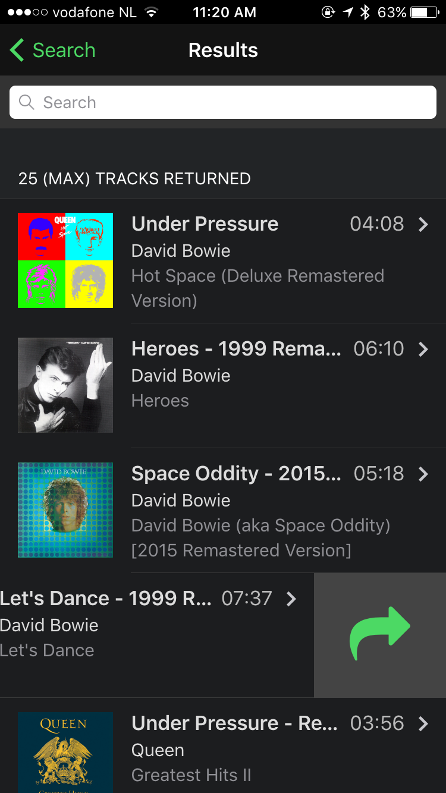

### Overview
In this step we'll add a common mobile UX feature to our app to make it more useful; swipeouts. Swipeouts
allow you to swipe left or right over list elements to reveal further actions.

The iOS Reminders app is a good example of an app using swipeouts:

   

## Steps
1. Take a moment to review the [Framework7 Swipeout Docs](http://framework7.io/docs/swipeout.html)

1. Open `index.html` and add the `swipeout` class to the current `<li>` tag:

      <li class="swipeout">

2. Now add a new `
` element with the class of `swipeout-content` just below it the `<li>`
and end it after the <`li`>

      

2. Add the following snippet just before the closing `<\li>`. This code will create the action itself
with a link containing a `share` class that we'll list to for clicks and pass along the index of the
item clicked. It also sets the share icon based on the platform.
 
                <!-- Swipeout actions right -->                
                

                    <!-- Swipeout actions links/buttons -->
                    <a href="#" class="share" data-item="{{@index}}">
                    {{#if @global.material}}
                        <i class="icon fa fa-share-alt fa-3x"></i></a>
                    {{else}}
                        <i class="icon fa fa-share fa-3x"></i></a>
                    {{/if}}                      
                

     

     

2. In the above definition we have an icon which acts as a button in the `swipeout-actions-right` 
but it doesn't actually do anything yet. It requires click handling code to invoke a *share* feature 
that will be added in the next lesson.

4. Run your app to ensure you see the new swipeout action on the right side when you swipe on a list item.

      

   >IMPORTANT: Based on the Framework7 docs, the swipeout support will not work well in the browser so you should test this feature via the PhoneGap Developer App or the CLI locally.

<a href="lesson4.html" class="btn btn-default"><i class="glyphicon glyphicon-chevron-left"></i> Previous</a>
<a href="lesson6.html" class="btn btn-default pull-right">Next <i class="glyphicon
glyphicon-chevron-right"></i></a>

